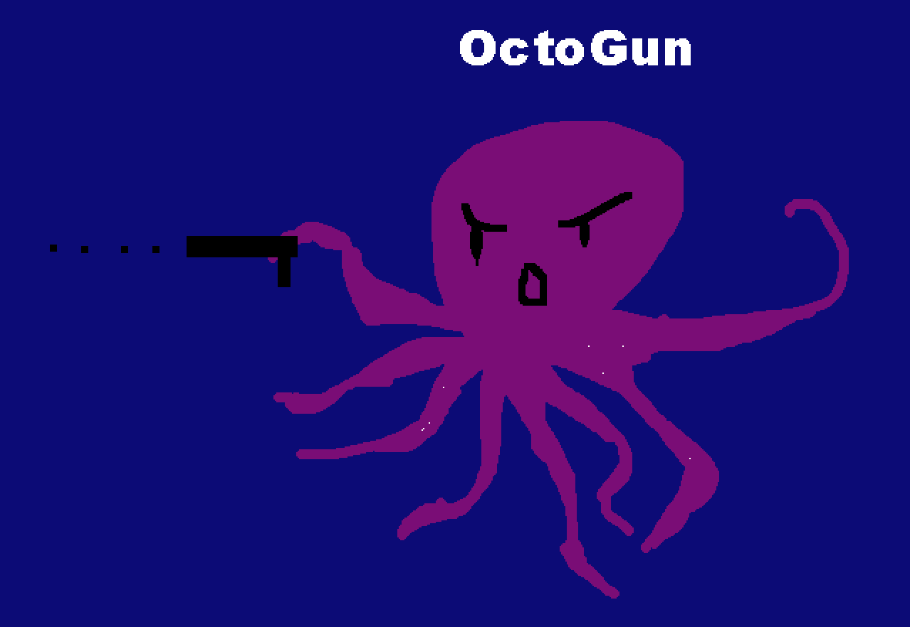
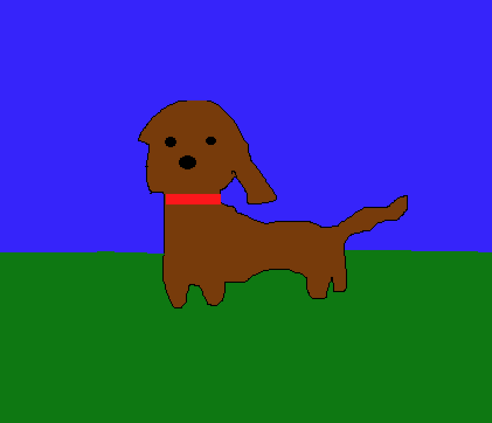
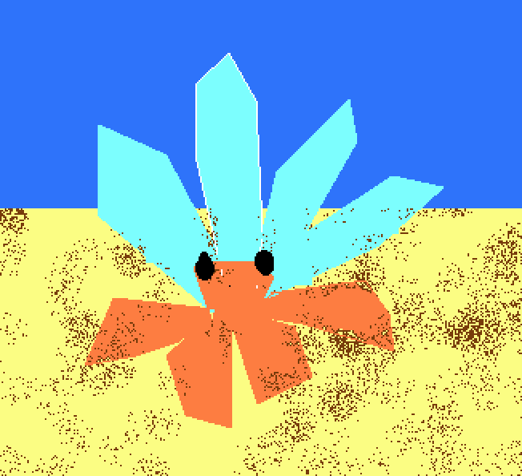
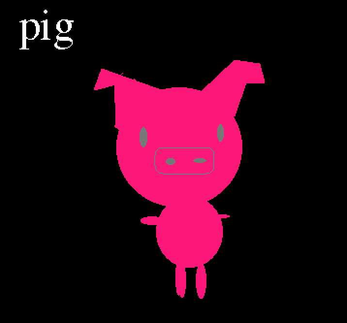

# Python Flex Week 

Why Python? Some of the JavaScript coding challenges I've tried before heavily relied on precise math calculations. Imagine my surprise when I found out that numbers don't work well in JavaScript. I heard good things about Python and it's advantages when working with data and math. So decided to give it a try. Plus, the girls that I co-teach in Boston are also learning some basic Python to make a game and to command a lego robot. Definately a plus if I'm able to assist them. 

## Quick Links
1. [Python Demo Start](python_demo.py)
2. [Python GUI & Polygons](mypolygon.py)
3. [Flowers](flowers.py)
4. [Conditionals](conditionals.py)
5. [Fizz Buzz](fizzbuzz.py)

## Dev Instructions
- Requirements: Python, an IDE
- Clone this repo into your directory of choice
- You can run a specific file by changing directory to the current directory `cd :directorypath` and entering the command python :directorypath. Example:

```bash
user@trisha:~/projects/python$ python fizzbuzz.py
```

## How to get started?

### Step 1: 
My environment is already optimized for MacOS and VS Code. Here's how I got started: 

- Check to see if you have Python already installed via command `Python3 --version`
- If it returns something like `Python 3.7.0` then you're good. You can update your current version if you like. 
- Run `which python` to check that the path is something like `/usr/local/bin/python`
- If you don't have Python installed a.k.a. nothing returned or there was an error when you typed in `Python3 --version` then you can enter `brew install python3`

### Step 2: 
Install extensions on VS Code. This is mainly:

- Python
- Python Extension (by Don Jayamanne)
- Code Runner (run a script file via CTRL + ALT + N)
- Pylinter 

### Step 3:  
- Follow along this awesome free book by **Allen D. Downey** [Think Python: How to Think Like a Computer Scientist](http://greenteapress.com/thinkpython2/html/index.html)
- Supplemental video [edureka!](https://www.youtube.com/watch?v=NKVOjPHfiSA&t=566s)

### Step 4:  
Attempt to create the most basic Pygame
- [Python Programming Tutorials By Tech With Tim](https://www.youtube.com/watch?v=OFrLs22MDAw&list=PLzMcBGfZo4-mFu00qxl0a67RhjjZj3jXm)

**DRATS! BUGS!**

- Known issue with MacOS Mojave, game not rendering [Graphical Overlay Bug](https://github.com/pygame/pygame/issues/555)

### Step 5: 
Project Ideas

- A keyboard controlled game using Pygame, I got a couple of ideas like navigating scenes to collect things, managing the state, and using a sprite image. However, there's a bug on MacOS Mojave when it comes to rendering the GUI. 
    - Gunslinger octupus, you are an octopus who's got some skill with the gun. You must successfully shoot all sharks, eels, and dolphins before they get too close to you.

  
  
    - You are a dog. You need to collect certain things for your master so you can be a good boy to get your treat. For example, you should collect 3 hot dogs or a pair of matching socks. 

  

    - You are a hermit crab and you want to swap your shell for a better one. You must fulfill the requests of other hermit crabs by collecting items so  you can trade-up your shell with them

  

- If the Pygame doesn't work, I'll probably do a web based app that will help you record a list of **Beautiful Memories**. There could be a game where you can click on a button, an algorithm picks a random memory bank and you have to draw a picture based off on that.
- But because of the short week, I might just make up a list of words like (pig, cat, dog, mouse) and have the person draw an image of the animal. 
- Or I can do colors and the user has to draw something of that color. 

  
